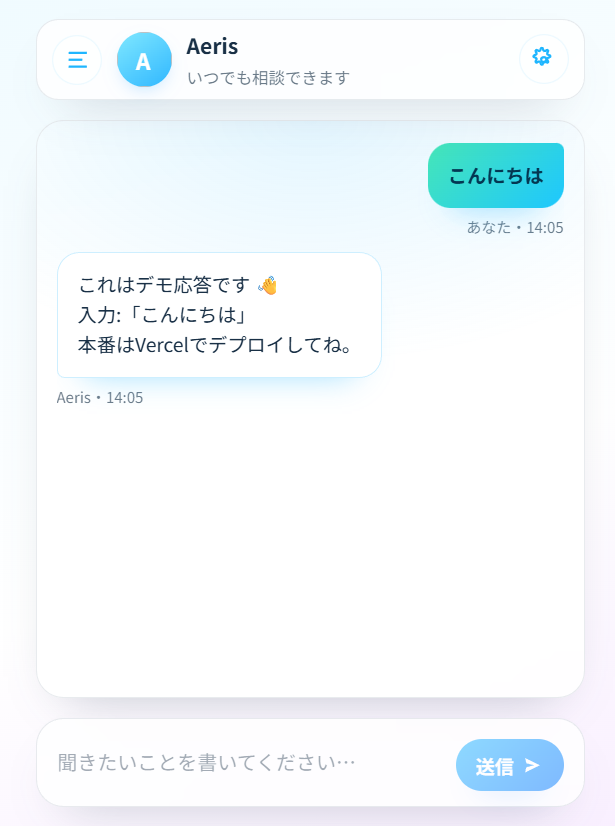

# ふらっとAI - スマホ用チャットUIテンプレート

OpenAI APIを手軽に試せる、スマートフォンに最適化されたチャットUIのテンプレートです。
面倒な設定は不要。最短1分で、あなただけのAIチャットアプリを公開できます。



## ✨ 特徴

- 📱 **スマホに最適化**: スマートフォンの画面で見やすく、操作しやすいデザインです。
- 🚀 **すぐに試せる**: 面倒な環境構築は不要。Vercelへのワンクリックデプロイに対応。
- ⚙️ **カスタマイズ可能**: アシスタントの名前やアイコン、性格（システムプロンプト）を自由に変更できます。
- 🔒 **セキュア設計**: APIキーが外部に漏れない安全な仕組みを採用しています。

---

## DEMO

まずは、UIの使い心地をデモで体験してみてください。

➡️ **[デモページを開く](https://omochi7777.github.io/Flatto-AI/?demo=1)**

※デモモードでは、実際のAIとの会話（API通信）はできません。

---

## 🚀 最短1分！はじめ方 (Vercelデプロイ)

**必要なもの**
*   **GitHubアカウント**
*   **Vercelアカウント** (GitHub連携で無料登録できます)
*   **OpenAI APIキー**

### ⚠️ 重要：デプロイに関する注意
セキュリティ上、**このリポジトリはGitHub Pagesで運用しないでください**。
必ず以下の手順で **Vercel** を利用し、APIキーは**環境変数**に設定してください。

### デプロイ手順

1.  下のボタンをクリックして、Vercelにプロジェクトを作成します。

    [](https://vercel.com/new/clone?repository-url=https%3A%2F%2Fgithub.com%2Fomochi7777%2FFlatto-AI&env=OPENAI_API_KEY)
    *(注: 上記URLの `repository-url` は、ご自身のGitHubリポジトリのURLに書き換えてください)*

2.  Vercelの画面が開いたら、指示に従ってリポジトリ名などを決定します。
   
   ※プロジェクト名は 小文字・数字・. _ - のみ（例: flatto-ai）。
   　Flatto-AI のような大文字は不可です。
   　✅ flatto-ai, flatto-ai-001, flatto.ai
　　　❌ Flatto-AI, Flatto AI, flatto@ai

3.  **Environment Variables（環境変数）**の欄に、取得しておいたあなたの `OPENAI_API_KEY` を貼り付けます。

4.  `Deploy` ボタンを押せば完了です！数分であなた専用のチャットURLが発行されます。

---

## 使い方

デプロイが完了したら、発行されたURLにアクセスしてください。

1.  右上の歯車アイコン（⚙️）をタップして設定画面を開きます。
2.  アシスタントの名前やステータス、システムプロンプトなど、お好みの設定に変更します。
3.  「保存」ボタンを押せば、すぐにチャットを開始できます！

---

## 📖 もっと詳しく知りたい方へ

AIのアイコン画像の変更方法や、各ファイルの詳しい解説、カスタマイズのヒントなどをnoteで公開しています。

➡️

---

<details>
<summary>上級者向け：Vercel CLIでのデプロイ</summary>

1. 右上 **Code → Download ZIP** でコードをPCに保存し、解凍します。
2. フォルダ内でターミナル（コマンドプロンプト）を開き、以下のコマンドを実行します。

```bash
npm i -g vercel
vercel login
vercel env add OPENAI_API_KEY   # ここでOpenAIのAPIキーを入力
vercel --prod

